# Docker para programadores Java

## Aprenderás a...

* Generar un pequeño proyecto que implemente un API REST con Springboot
* Ejecutar la jvm en un contenedor
* Utilizar un IDE gráfico
* Depurar en vivo el proyecto desplegado en el contenedor
* Crear Dockerfiles para tus proyectos

## Requisitos

* Docker 
* Un IDE, preferiblemente [Netbeans](https://netbeans.org/downloads/) con [Springboot plugin](https://github.com/AlexFalappa/nb-springboot)

## Creación de un proyecto

* Si no estás familiarizado con Java y quieres terminar cuanto antes puedes descargar desde [github](https://github.com/ciberado/docker-java-workshop/releases/tag/basic) el proyecto básico.

* Visita [http://start.spring.io/](http://start.spring.io/) y crea un nuevo proyecto con las referencias a `web`, `actuator`, `lombok` y `devtools`. Descarga y descomprime la carpeta correspondiente. 

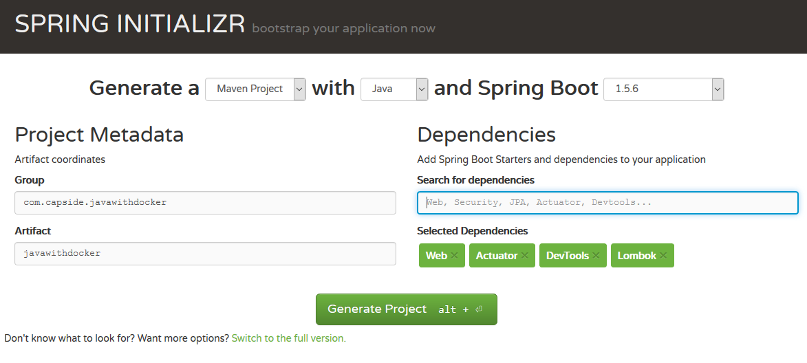

* Abre el proyecto desde el IDE y recupera las referencias necesarias. Comprueba que en `~/.m2` tienes el repositorio con la cache de Maven.

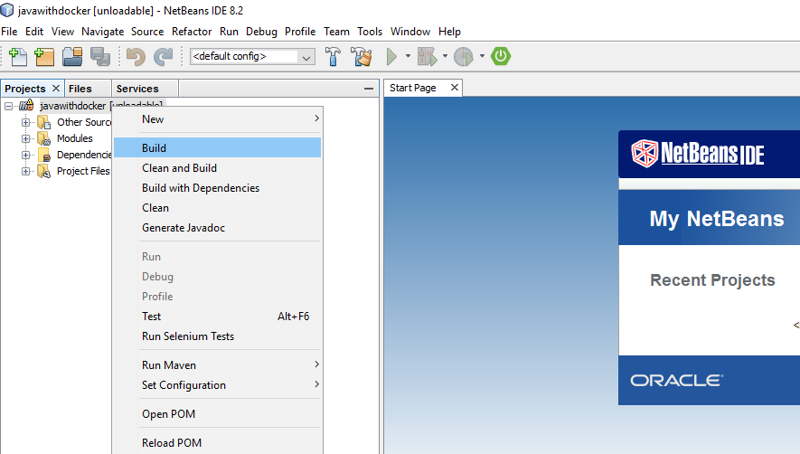

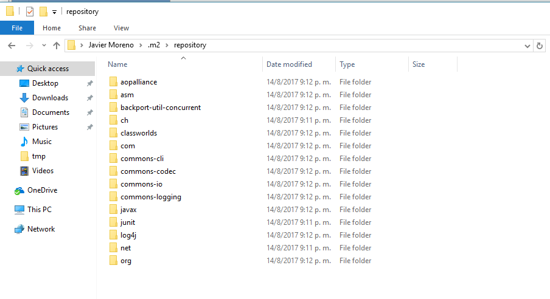

* Crea el componente de modelo que implementa un mensaje de texto (`Message.java`)

``` java
package com.capside.javawithdocker.javawithdocker;

import lombok.AllArgsConstructor;
import lombok.Data;

/**
 *
 * @author Javi
 */
@AllArgsConstructor @Data
public class Message {
    private String text;
}
```

* Añade un controlador (`APICtrl.java`)

```
package com.capside.javawithdocker.javawithdocker;

import org.springframework.web.bind.annotation.GetMapping;
import org.springframework.web.bind.annotation.RequestParam;
import org.springframework.web.bind.annotation.RestController;

/**
 *
 * @author Javi
 */
@RestController
public class APICtrl {
    
    @GetMapping(path = "/messages", params = "type=greetings")
    public Message greetings(@RequestParam(defaultValue = "dear") String name) {
        return new Message(String.format("Greetings %s.", name));
    }
    
    @GetMapping(path = "/messages", params = "type=oops")
    public void shutdownByABug() {
        System.exit(1);
    }
}
```

* Opcionalmente ejecuta el programa y pruébalo abriendo las direcciones `http://localhost:8080/messages?type=greetings&name=Alice` y `http://localhost:8080/messages?type=oops` desde tu navegador.

Ya tienes tu proyecto creado y funcionando. En otro workshop añadiremos tests unitarios y de integración pero ahora vamos a ver cómo podemos ejecutarlo dentro de un contenedor.

## Utilizando Maven desde Docker

* Asegúrate de que Docker for Windows tiene acceso al disco en el que estás trabajando:

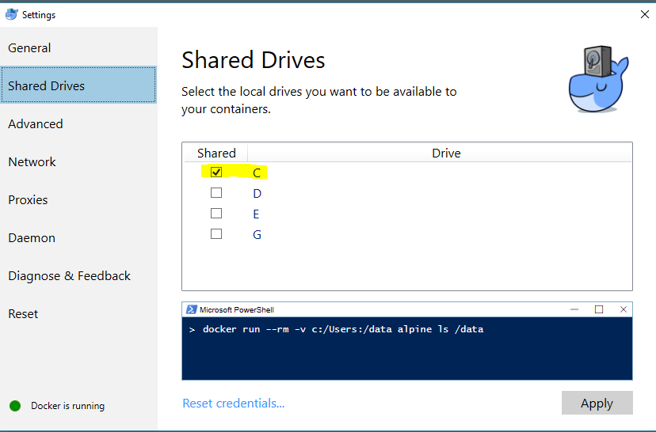

* Abre una consola (bash o CMD) y mueve el prompt a la carpeta que contiene el proyecto (`/tmp/javawithdocker`, por ejemplo). Ejecuta un contenedor interactivo con soporte para Maven en el que puedas acceder al código:

``` CMD
REM windows version
docker run -it --name java --rm ^
-v "%CD%":/app ^
-e "TERM=xterm-256color" ^
-w /app ^
maven:3-jdk-8 bash
```

``` bash
# bash version
docker run -it --name java --rm \
-v "$PWD":/app \
-e "TERM=xterm-256color" \
maven:3-jdk-8 bash
```

* Comprueba que estás en la carpeta que contiene el código y compílalo. Apunta cuánto tiempo tarda en completarse el proceso

``` bash
root@xxx:/app# ls
root@xxx:/app# mvn package
root@xxx:/app# exit
```

* Lanza un nuevo contenedor pero esta vez asegúrate de montar el repositorio local de Maven.

``` CMD
REM windows version
docker run -it --name java --rm ^
-v "%CD%":/app ^
-v "%USERPROFILE%"/.m2:/root/.m2  ^
-e "TERM=xterm-256color" ^
-w /app ^
maven:3-jdk-8 bash
```

``` bash
# bash version
docker run -it --name java --rm \
-v "$PWD":/app \
-v "$HOME"/.m2:/root/.m2  \
-e "TERM=xterm-256color" \
maven:3-jdk-8 bash
```

* Repite el proceso de compilar el proyecto y compara los tiempos empleados por Maven:

```
root@xxx:/app# mvn package
root@xxx:/app# exit
```

## Probando la aplicación

* Lanza el contenedor abriendo los puertos 8080 (que utiliza por defecto nuestro proyecto) y el 5005 (para depurar remotamente). 

``` CMD
REM windows version
docker run -it --name java --rm ^
-v "%CD%":/app ^
-v "%USERPROFILE%"/.m2:/root/.m2  ^
-e "TERM=xterm-256color" ^
-w /app ^
--publish 8080:8080 ^
--publish 5005:5005 ^
maven:3-jdk-8 bash
```

``` bash
# bash version
docker run -it --name java --rm \
-v "$PWD":/app \
-v "$HOME"/.m2:/root/.m2  \
-e "TERM=xterm-256color" \
--publish 8080:8080 \
--publish 5005:5005 \
maven:3-jdk-8 bash
```

* Ejecuta la aplicación haciendo que espere a que un depurador externo se conecte a la jvm:

``` bash
java -Xdebug -Xrunjdwp:server=y,transport=dt_socket,address=5005,suspend=y -jar target/javawithdocker-0.0.1-SNAPSHOT.jar
```

* Activa el depurador remoto de Netbeans. Si estás utilizando *docker-machine* asegúrate de utilizar la IP de la máquina virtual en lugar de `127.0.0.1`.

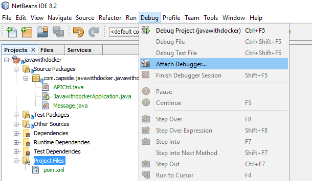

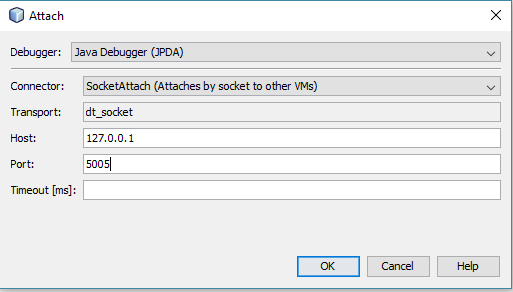

* Fija un breakpoint en el código de `APICtrl.java`:

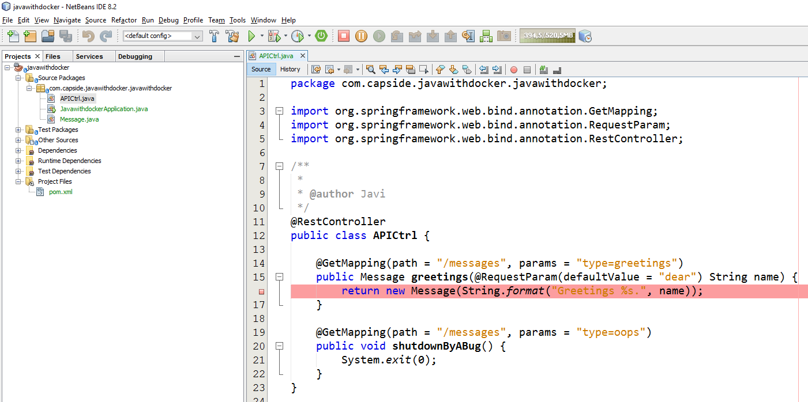

* Invoca de nuevo el servicio abriendo `http://localhost:8080/messages?type=greetings&name=Alice` y utiliza las herramientas de depuración para comprobar el valor de la variable `name`.

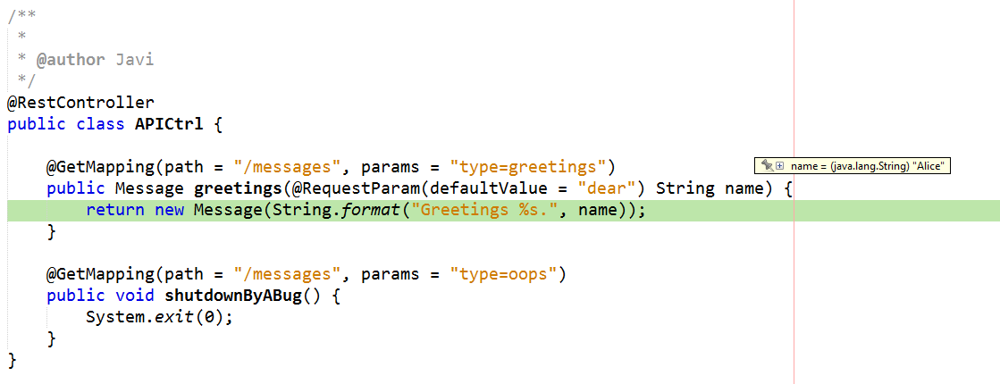

* Elimina el breakpoint.
* Modifica el código del controlador para que el mensaje esté en mayúsculas y pulsa el botón para realizar una modificación en caliente en la jvm:

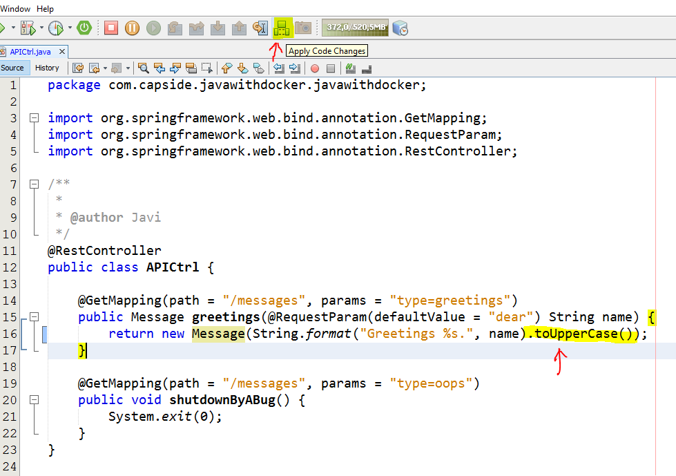

* Agrega una nueva operación en `APICtrl.java`

``` java
@GetMapping(path = "/messages", params = "type=goodbye")
public Message goodbye(@RequestParam(defaultValue = "dear") String name) {
	return new Message(String.format("Have a nice day, %s.", name).toUpperCase());
}
```

* Si intentas ejecutar de nuevo un hot-fix obtendrás un mensaje como el siguiente: *The virtual machine does not support this operation: add method not implemented*. Pero calma, ahora lo arreglamos.

## Context restarting bajo demanda

* Si no quieres pelearte con Netbeans o Java puedes bajar el proyecto actualizado desde [github](https://github.com/ciberado/docker-java-workshop/releases/tag/livedebugging-1).

* Crea un fichero `.reloadtrigger` en la raíz del proyecto. Modificar este fichero provocará la recarga del contexto de Spring.

* Añade las siguientes líneas a `application.properties` para que Spring sepa que debe monitorizar dicho fichero

``` properties
spring.devtools.restart.additional-paths=.
spring.devtools.restart.trigger-file=.reloadtrigger
```

* Utiliza la tarea de Maven `spring-boot:run` para ejecutar la aplicación en lugar de invocar directamente la jvm. Puedes comprobar cómo se utiliza `-Drun.jvmArguments` para especificar opciones de la jvm y `-D` directamente para indicar opciones de la aplicación. 

``` bash
mvn spring-boot:run \
-Drun.jvmArguments="-Xdebug -Xrunjdwp:transport=dt_socket,server=y,address=5005,suspend=y" \
-Dserver.port=8080
```

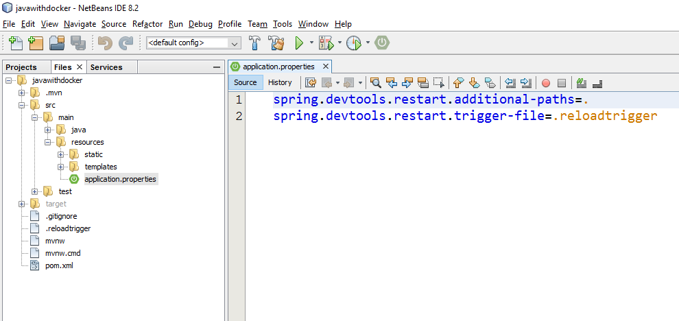

* Conecta de nuevo el depurador

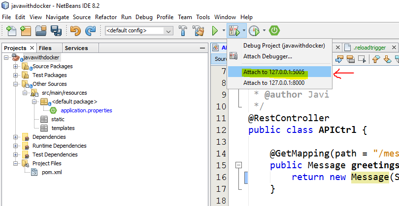

* Edita de nuevo `APICtrl.java` (por ejemplo añadiendo la operación con la que probamos antes). 

``` java
@GetMapping(path = "/messages", params = "type=goodbye")
public Message goodbye(@RequestParam(defaultValue = "dear") String name) {
	return new Message(String.format("Have a nice day, %s.", name).toUpperCase());
}
```

* Si revisas el output de consola verás que al guardar no sucede nada pero que sin embargo al generar cualquier cambio en `.reloadtrigger` el contexto se recarga completamente.

* Invoca la nueva operación abriendo `http://127.0.0.1:8080/messages?type=goodbye`. En caso de que no se hayan aplicado los cambios que hemos hecho ejecuta un *build*.

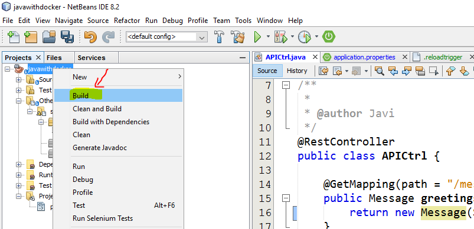

## Creación de una imagen básica

* Vamos a convertir nuestro proyecto en una imagen de la forma más sencilla posible. Si no te ves picando códigos puedes descargar la versión del proyecto desde [github]().
* Crea un archivo Dockerfile en la raíz del proyecto

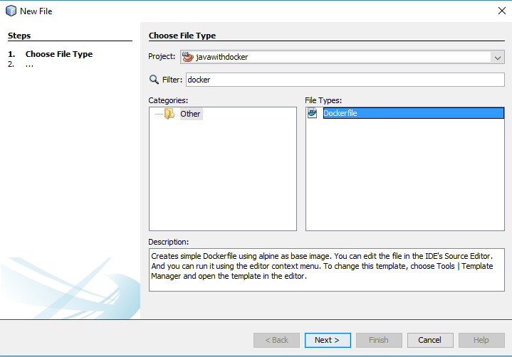

* Copia el siguiente contenido al `Dockerfile`

``` dockerfile
FROM java:8u111-jre-alpine
MAINTAINER Javi Moreno <javi.moreno@capside.com>

COPY target/*.jar /app.jar

EXPOSE 8080

ENTRYPOINT  ["java", "-jar", "/app.jar"]

CMD [""] 
```

* Responde: ¿Por qué crees que no utilizamos la misma imagen base que en desarrollo? ¿Qué implicaciones tiene esto? ¿Cómo minimizarías los riesgos asociados?

* Utiliza la línea de comando para construir la imagen (vigila el punto final, es fácil olvidarlo). Sustituye *<repositorio>* por el nombre de tu repositorio.

```
mvn clean package
docker build -t <repositorio>/javawithdocker .
```

* Sube el archivo al repositorio

``` bash
docker login
docker push <repositorio>/javawithdocker
```

* Ejecuta la imagen

``` bash
docker run -it -p 8080:8080 --name demo --rm <repositorio>/javawithdocker
```

## Agregando resiliencia

* Modifica el Dockerfile para que incluya un *health check*

```
FROM java:8u111-jre-alpine
MAINTAINER Javi Moreno <javi.moreno@capside.com>

COPY target/*.jar /app.jar

EXPOSE 8080

ENTRYPOINT  ["java", "-jar", "/app.jar"]

HEALTHCHECK  --start-period=60s --interval=20s --timeout=5s --retries=3 \
             CMD wget -q -s http://127.0.0.1:8080/health || exit 1 

CMD [""]
```

* Reconstruye la imagen

```
mvn clean package
docker build -t <repositorio>/ciberado .
```

* Lanza el contenedor con la opción de reiniciar en caso de error (o *always*, si la prefieres). **ATENCIÓN**: un container *unhealthy* no se reinicia de forma automática aunque *swarm* no enviará tráfico al mismos hasta que pase a ser *healthy*.

``` bash
docker run -d -p 8080:8080 --name demo --restart on-failure ciberado/javawithdocker
```

* Comprueba el estado del contenedor

``` bash
REM windows
docker ps
docker inspect --format="{{json .State.Health.Status}}" demo
```

``` bash
# bash
docker ps
docker inspect --format='{{json .State.Health.Status}}' demo
```

* Invoca el endpoint con `System.exit` para generar una salida anómala abriendo  ```127.0.0.1:8080/messages?type=oops``` con el navegador.

* Comprueba que el contenedor se ha reiniciado automáticamente en apenas unos segundos

``` bash
docker ps
```

* Elimina el contendor

```
docker rm --force demo
```

## Conclusión

¡Enhorabuena! Ya eres capaz de integrar tu entorno de desarrollo preferido con Docker y de generar imágenes como artefactos a publicar. A partir de aquí deberías explorar:

* Cómo orquestar todo tu stack incluyendo la base de datos
* Cómo gestionar los tests de integración y end-to-end
