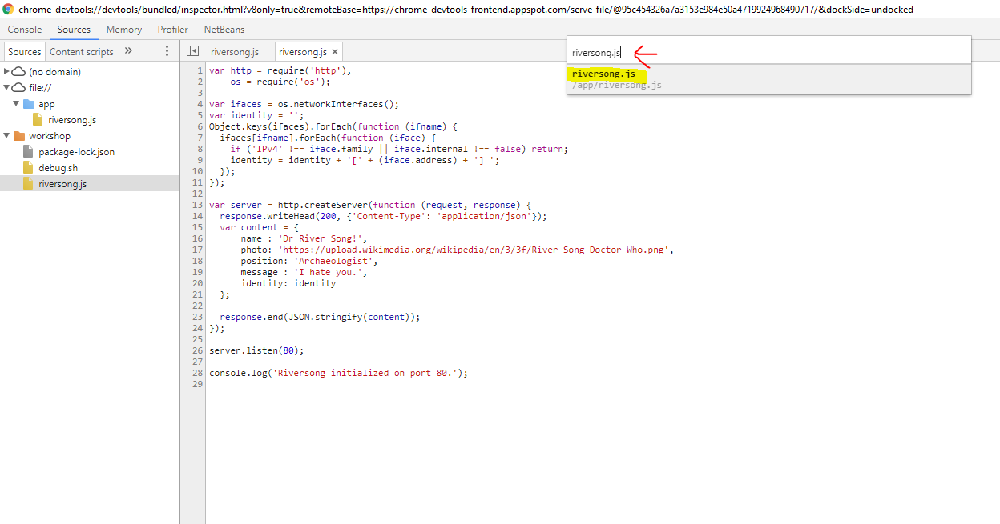

# Docker for Nodejs developers

## You will learn how to

* Start Nodejs apps inside a container
* Debug from Chrome these applications
* Create a efficient workflow

## Requirements

* Docker 
* Chrome
* Please, replace `<local-folder>` with the path to your working directory all along this document. 

## Executing node inside a container

* It is really easy to use different Nodejs versions. Try `node:alpine` image, for example:

```
docker run --rm -it node:alpine
> console.log('Hi world!');
> .exit
```

## Creating a project

* Using your favorite poison please create a working directory (for example, `/workshop`) and add the file `riversong.js`to it. Place this content inside:

```
var http = require('http'),
    os = require('os');

var ifaces = os.networkInterfaces();
var identity = '';
Object.keys(ifaces).forEach(function (ifname) {
  ifaces[ifname].forEach(function (iface) {
    if ('IPv4' !== iface.family || iface.internal !== false) return;
    identity = identity + '[' + (iface.address) + '] ';
  });
});

var server = http.createServer(function (request, response) {
  response.writeHead(200, {'Content-Type': 'application/json'});
  var content = {
      name : 'Dr River Song!',
      photo: 'https://upload.wikimedia.org/wikipedia/en/3/3f/River_Song_Doctor_Who.png',
      position: 'Archaeologist',
      message : 'I hate you.',
      identity: identity
  };

  response.end(JSON.stringify(content));
});

server.listen(80);

console.log('Riversong initialized on port 80.');
```

## Executing the project inside a container

* Use the next order to execute the appliation inside a container:

```
docker run --rm --detach --publish 80:80 -w=/app --volume <local-folder>:/app node:alpine node riversong.js
```

* Comprueba que puedes acceder con el navegador a la aplicación en `localhost:80`. A continuación termina el contenedor con `docker kill <container-id>`.

## Activando la depuración remota

* Crea de nuevo el contenedor pero esta vez utiliza el flag `--inspect` para activar la depuración remota (el puerto por defecto es el `9229`).

```
docker run --rm -it --publish 80:80 --publish 9229:9229 -w=/app --volume <local-folder>:/app node:alpine node --inspect=0.0.0.0:9229 riversong.js
```

* Accede a la depuración remota desde Chrome abriendo la dirección `about:inspect`. Pulsa en el botón `inspect`.


* Despliegua los nodos necesarios en el árbol izquierdo para ver el código fuente de `riversong.js`. Pulsa sobre el número de línea 14 para fijar un breakpoint:


* Invoca desde otra ventana la aplicación abriendo `localhost:80` y verás que puedes inspeccionar variables y ejecutar paso a paso sin ningún problema.

* Cuando termines asegúrate de eliminar el contenedor. Puedes utilizar `docker ps` para averiguar su identificador y `docker kill <id>` para acabar con él rápidamente.

## Activando la recarga de código

`nodemon` es un *wrapper* para node que facilita la recarga del proyecto. Puede hacerlo cuando modificas uno de los ficheros o bajo demando cuando recibe la orden `rs`. Vamos a añadirlo para poder editar desde la carpeta local y recargar el código si necesidad de crear un nuevo contenedor.

* Crea este pequeño script en un fichero llamado `debug.sh`:

```
#/bin/sh

npm install -g nodemon
nodemon --inspect=0.0.0.0:9229 riversong.js
```

* Básicamente instala `nodemon` y tras ello ejecuta nuestro programa. Arranca un contenedor que lo lance con 

```
docker run --rm -it --publish 9229:9229 --publish 80:80 -w/app --volume <local-folder>:/app node:alpine /bin/sh -c "/app/debug.sh" 
```

* Utiliza tu editor preferido para cambiar el código. Por ejemplo, sustituye la línea 16:

```
---
name : 'Dr River Song!',
+++
name : 'Dr River Song!!!!!!!!!!!!',
```

* Utiliza la ventana en la que estás ejecutando `nodemon` parle la orden de recarga: 

```
rs
```

* Abre con tu navegador la aplicación y verás que los cambios se han aplicado sin reinicar el contenedor: `http://localhost:80`

## Editando desde Chrome

* Chrome lleva incorporado un IDE para Javascript muy cómodo. Para activarlo utiliza el botón derecho sobre el explorador de la izquierda y selecciona la opción `Add folder to workspace`. A continuación busca la carpeta en la que tienes el código de tu aplicación y acepta dar permisos al navegador para manipularla:


* Indícale a Chrome la relación entre las rutas que se cargan en el navegador y los ficheros de la carpeta que has añadido como workspace. Para ello pulsa con el botón derecho sobre el fichero `riversong.js` y pulsa sobre `Map to network resource`. Después selecciona la ruta que te sugiere que encaja con él:


 


## Optimizando con Dockerfiles

Descargar `nodemon` en cada ejecición es muy lento. Vamos a crear una imagen que incluya todas esas dependencias como un *layer* de manera que solo sea necesario ejecutar `npm` en el momento de construirla.

* Crea un fichero llamado `Dockerfile-dev` (sin extensión) en la carpeta de trabajo y pon esto como contenido:

```
FROM node:alpine
RUN npm install -g nodemon
COPY riversong.js .
EXPOSE 80
CMD ["nodemon", "--inspect=0.0.0.0:9229", "riversong.js"]
```

* Ejecuta el comando `build` para construir la imagen (no te olvides del punto para indicar la carpeta de contexto).

```
docker build -t riversong:dev -f Dockerfile-dev . 
```

* Ya puedes lanzar de forma casi instantánea tu contenedor de desarrollo:

```
docker run --rm -it --publish 9229:9229 --publish 80:80 -w/app --volume <local-folder>:/app riversong:dev
```

## Crear una versión para producción

* El `Dockerfile` para producción es aún más sencillo:

```
FROM node:alpine
COPY riversong.js .
EXPOSE 80 
CMD ["node", "riversong.js"]
```

* Crea la imagen (recuerda que debes sustituir *<repo>* por el nombre de tu repositorio) y súbela al Docker Hub:

```
docker build -t <repo>/riversong:port80 .
docker push <repo>/riversong:port80
```

## Conclusiones

Ya sabes cómo puedes disfrutar de las ventajas de utilizar Docker sin perder la capacidad de editar el código cómodamente y depurarlo con las herramientas a las que estás acostumbrado.


