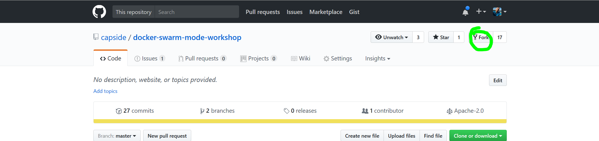
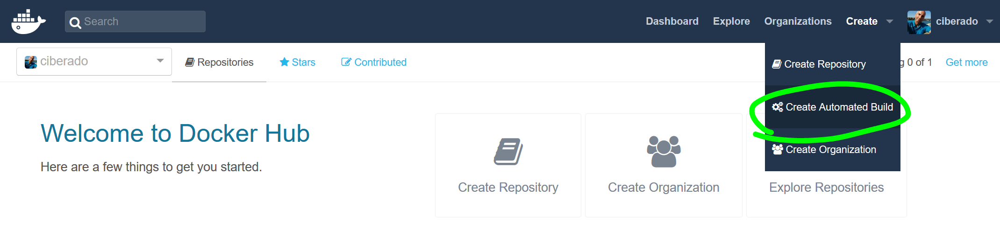
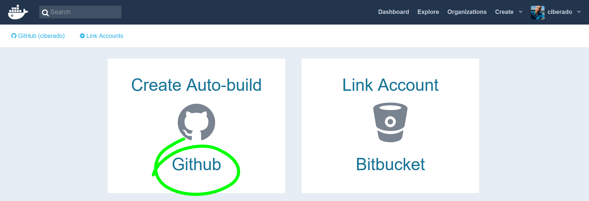
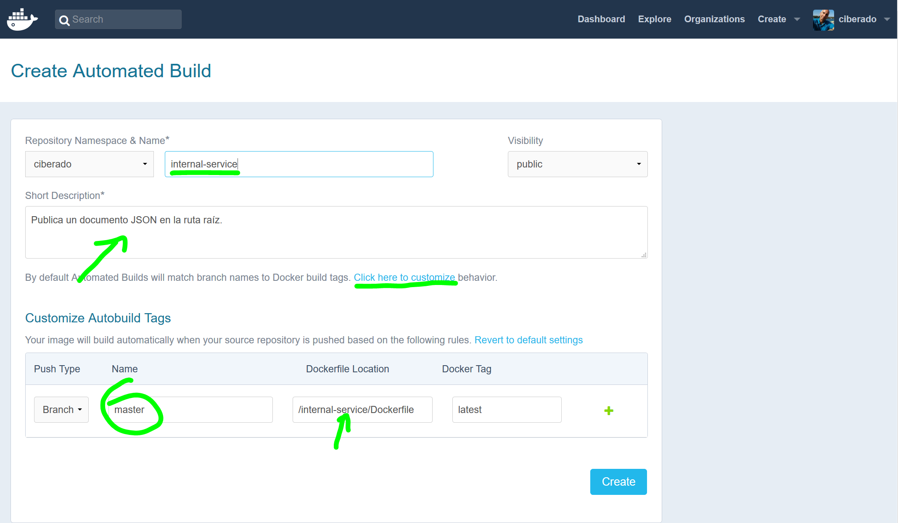
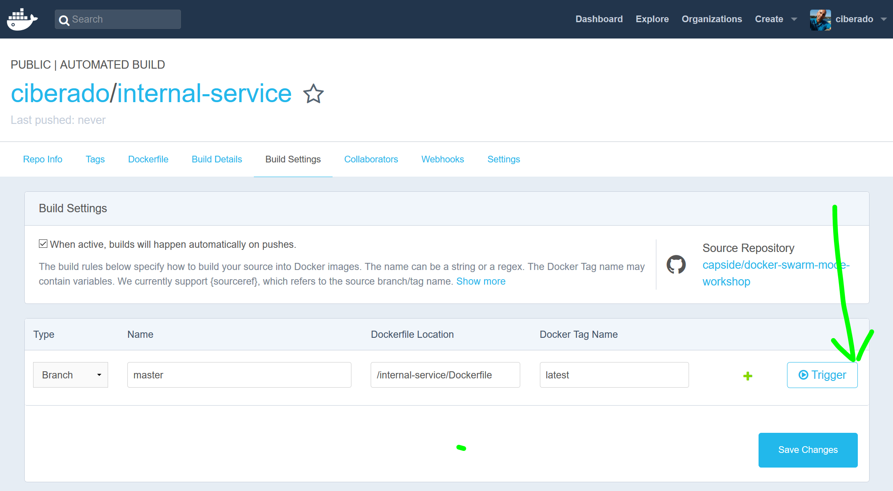
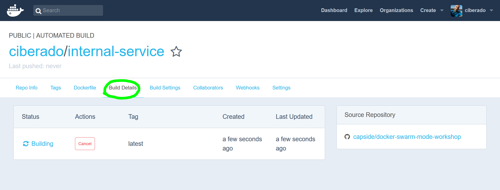

# Builds automáticos

## Aprenderás a...

* Crear imágenes auditables de forma automática a partir de un commit
* Desplegar contenedores y gestionarlos
* Interconectar contenedores a usando *links*
* Interconectar contenedores a través con *networks*

## Proyecto y Dockerfile

* Realiza tu propio fork del [código del proyecto](https://github.com/capside/docker-swarm-mode-workshop/tree/master/internal-service) en tu cuenta de github



* Incluye dos aplicaciones: [internal-service](https://github.com/capside/docker-swarm-mode-workshop/tree/master/internal-service) y [edge-service](https://github.com/capside/docker-swarm-mode-workshop/tree/master/edge-service), nos centraremos en la primera.

Se trata de un servidor http mínimo en nodejs y el Dockerfile asociado:

```
FROM node:7.10.0-alpine
COPY RiverSongService.js .
EXPOSE 8888
CMD ["node", "RiverSongService.js"]
``` 

* Lee el [Dockerfile de node:7.10.0-alpine](https://github.com/nodejs/docker-node/tree/master/7.10/alpine)
* Responde:
	* ¿Qué utilidad tiene construir una jerarquía de imágenes?
	* ¿Para qué sirven ENV, RUN y CMD?
	* ¿Por qué no utiliza un único RUN y genera dos layers?

## Build de imágenes automáticos	
	
* Crea una cuenta en https://hub.docker.com/
* Configura un *automatic build*



* Enlaza la cuenta con github


	
* Selecciona el proyecto


* Configura los detalles del build



* Lanza un nuevo build en *build settings*

	
	
* Espera a que finalice en *build details*



## Gestionando contenedores

* Instala [jq](https://stedolan.github.io/jq/download/) porque lo necesitarás para filtrar json
* Recuerda que puedes juegar con la sintaxis de jq en https://jqplay.org
* Revisa tu entorno de Docker

```
docker info
```

* Ejecuta la imagen en un contenedor
```
docker run ^
	--detach ^
	--name internal_service ^
	--rm \ 
	--publish 80:8888  ^
	--label priority=medium ^
	<tu-repositorio>/internal-service
```

* Localiza los servicios con prioridad *medium* (también puedes usar `docker container ls`)

```
 docker ps --format {{.ID}}\t{{.Names}}\t{{.Image}}\t{{.Labels}} --filter name=serv --filter label=priority=medium
```

* Revisa su configuración general y lista los puertos publicados

```
docker inspect internal_service
docker inspect internal_service | jq '.[0].NetworkSettings.Ports | to_entries[] | "\(.key) -> \(.value [].HostPort)"'
```

* Consigue lo mismo, pero *the easy way* ;-)

```
docker port internal_service
```

* Lee el log de salida del contenedor

```
docker logs internal_service
```

* Vigila el consumo de recursos 

```
docker stats
```
* Arranca el servicio externo

```
docker run ^
	--detach ^
	--name external_service ^
	--publish 81:80 ^
	--link internal_service ^
	--env INTERNAL_SERVICE_NAME=internal_service ^
	ciberado/external-service
```

* Comprueba que el servicio interno está publicado abriendo `localhost:81`

* Para los contenedores (también puedes usar `docker kill`)

```
docker stop internal_service
docker stop external_service
```

* Revisa todos los contenedores parados

```
docker ps -a --filter status=exited
```

* Elimina el contendor external_service (no utilizaste `--rm` al arrancarlo)

```
docker rm external_service
```

## Networking

* Crea una red y lanza los dos contenedores en ella **sin** enlazarlos

```
docker network create gallifrey
docker run ^
	--detach ^
	--name internal_service ^
	--label priority=medium ^
	--network gallifrey ^
	ciberado/internal-service
docker run ^
	--detach ^
	--name external_service ^
	--publish 80:80 ^
	--network gallifrey ^
	--env INTERNAL_SERVICE_NAME=internal_service ^
	ciberado/external-service	
```

* Comprueba que puedes acceder a la aplicación con el navegador (esta vez en el puerto 80) y que los contenedores siguen resolviendo sus nombres correctamente

* Elimina todos los contenedores 

Unix:
```
docker rm --force $(docker ps -aq)
```

Windows:
```
for /f %i in ('docker ps -aq') do docker rm --force %i
```

* Revisa el consumo de disco y recupera espacio (**CUIDADO CON EL -all**)

```
docker system df
docker system prune --all
```


